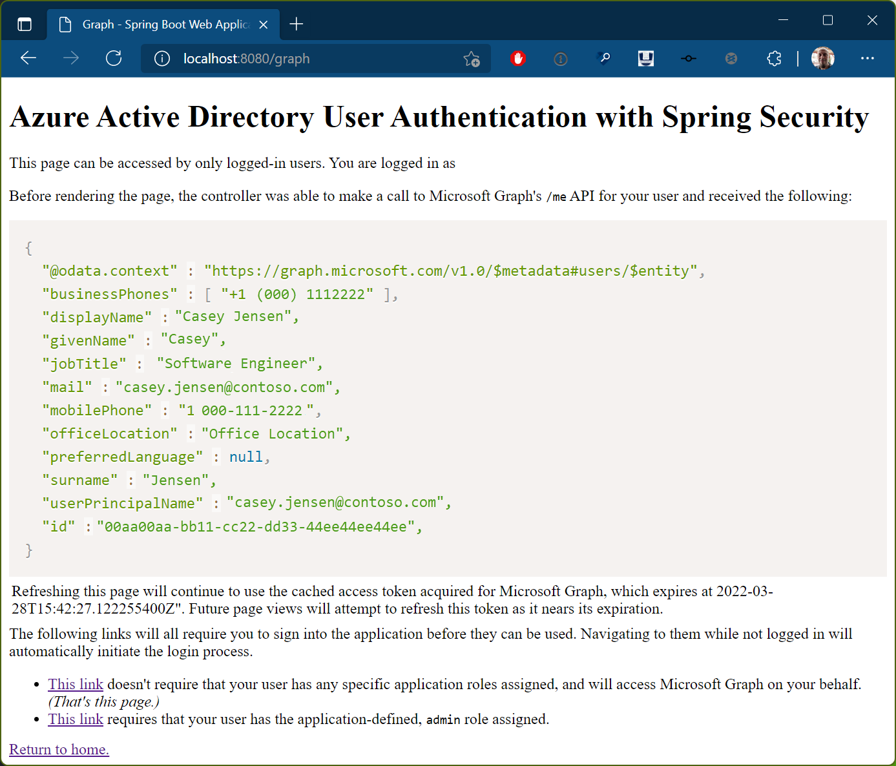
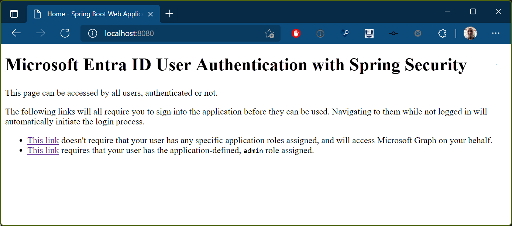

<!-- Keeping yaml frontmatter commented out for now
---
# Metadata required by https://docs.microsoft.com/samples/browse/
# Metadata properties: https://review.docs.microsoft.com/help/contribute/samples/process/onboarding?branch=main#add-metadata-to-readme
languages:
- java
page_type: sample
name: "Java web application written in Spring Boot that both protects its own endpoints and accesses Microsoft Graph"
description: "This Java web application protects various routes and contacts Microsoft Graph on behalf of the user. The code in this sample is used by one or more articles on docs.microsoft.com."
products:
- azure
- azure-active-directory
- ms-graph
urlFragment: ms-identity-docs-code-webapp-java
---
-->

<!-- SAMPLE ID: DOCS-CODE-008 -->

# Java Spring Boot | web app | user sign-in, access control (protected routes), protected web API access (Microsoft Graph) | Microsoft identity platform

<!-- Build badges here
  
-->

This sample demonstrates a Java Spring Boot web application that is both protected by Microsoft identity platform and accesses Microsoft Graph as the user by using the Microsoft Authentication Library (MSAL) for Java.



> :page_with_curl: This sample application backs one or more technical articles on docs.microsoft.com. <!-- TODO: Link to first tutorial in series when published. -->

## Prerequisites

- Azure Active Directory (Azure AD) tenant and the permissions or role required for managing app registrations in the tenant.
- Java 8+
- Maven

## Setup

### 1. Register the app

First, complete the steps in [Register an application with the Microsoft identity platform](https://docs.microsoft.com/azure/active-directory/develop/quickstart-register-app) to register the sample app.

Use these settings in your app registration.

| App registration <br/> setting | Value for this sample app                                                    | Notes                                                                                              |
|:------------------------------:|:-----------------------------------------------------------------------------|:---------------------------------------------------------------------------------------------------|
| **Name**                       | `java-webapp`                                                                | Suggested value for this sample. <br/> You can change the app name at any time.                    |
| **Supported account types**    | **Accounts in this organizational directory only (Single tenant)**           | Suggested value for this sample.                                                                   |
| **Platform type**              | **Web**                                                                      | Required value for this sample. <br/> Enables the required and optional settings for the app type. |
| **Redirect URI**               | `http://localhost:8080/login/oauth2/code/`                                   | Required value for this sample.                                                                    |
| **Client secret**              | _**Value** of the client secret (not its ID)_                                | :warning: Record this value immediately! <br/> It's shown only _once_ (when you create it).        |
| **App roles**                  | **Display name**: `admin`<br/>**Allowed member types:**: **Users/Groups**<br/>**Value**: `admin`<br/>**Description**: `admin app role` | Required role for this sample. <br/> One route requires your user to be assigned this role. |

Use these settings in your Enterprise Application for this sample app.

| Enterprise Application <br/> setting | Value for this sample app                    | Notes                                                                                        |
|:------------------------------------:|:---------------------------------------------|:---------------------------------------------------------------------------------------------|
| **Users and groups**                 | **User**: _yourself_<br/>**Role**: **admin** | Required value for this sample. <br/> One route requires your user to be assigned this role. |

> :information_source: **Bold text** in the tables above matches (or is similar to) a UI element in the Azure portal, while `code formatting` indicates a value you enter into a text box in the Azure portal.

### 2. Update code sample with app registration values

Open the [_application.yml_](src/main/resources/application.yml) file and modify the three Azure Active Directory configuration properties using the values from your [app's registration in the Azure portal](https://docs.microsoft.com/azure/active-directory/develop/quickstart-register-app).

```yaml
# 'Tenant ID' of your Azure AD instance - this value is a GUID
tenant-id: value-here

# 'Application (client) ID' of app registration in Azure portal - this value is a GUID
client-id: value-here

# Client secret 'Value' (not its ID) from 'Client secrets' in app registration in Azure portal
client-secret: value-here
```

### 3. Install package(s) and compile application

To install Spring Boot and MSAL libraries:

```bash
mvn install
```

## Run the application

```bash
mvn spring-boot:run
```

## Browse to the application

Open your browser and navigate to **http://localhost:8080**. If everything worked, the sample app should produce output similar to this:



## About the code

This Java web application uses the Spring Boot web framework. The app has three routes, each requiring a different authentication/authorization level.

When a signed-out user navigates to a route requiring authentication, their browser is redirected to the Azure AD sign-in page. After signing in, and if they've not previously done so, the user is asked to consent to the app's request for permission to access their data.

## Reporting problems

### Sample app not working?

If you can't get the sample working, you've checked [Stack Overflow](http://stackoverflow.com/questions/tagged/msal), and you've already searched the issues in this sample's repository, open an issue report the problem.

1. Search the [GitHub issues](../issues) in the repository - your problem might already have been reported or have an answer.
1. Nothing similar? [Open an issue](../issues/new) that clearly explains the problem you're having running the sample app.

### All other issues

> :warning: WARNING: Any issue in this repository _not_ limited to running one of its sample apps will be closed without being addressed.

For all other requests, see [Support and help options for developers | Microsoft identity platform](https://docs.microsoft.com/azure/active-directory/develop/developer-support-help-options).

## Contributing

If you'd like to contribute to this sample, see [CONTRIBUTING.MD](/CONTRIBUTING.md).

This project has adopted the [Microsoft Open Source Code of Conduct](https://opensource.microsoft.com/codeofconduct/). For more information, see the [Code of Conduct FAQ](https://opensource.microsoft.com/codeofconduct/faq/) or contact [opencode@microsoft.com](mailto:opencode@microsoft.com) with any additional questions or comments.